# Marketing_Campaign_Strategy
Trained with 37,000 datasets to determine best campaign strategy for collecting customer’s needs and overall satisfaction.

Objective: The purpose of marketing campaign is to collect customer’s needs and overall satisfaction. There are a few essential aspects of the marketing campaign namely, customer segmentation, promotional strategy, and etc.
Correctly identified strategy may help to expand and grow the bank’s revenue.

credit datasource: [HackerEarth HackLive: Customer Segmentation](https://www.kaggle.com/datasets/kunalgupta2616/hackerearth-customer-segmentation-hackathon)

# STEP 1) DATA LOADING

`df = pd.read_csv(CSV_PATH)`

# STEP 2) DATA INSPECTION
Segregate data in terms of Categorical and Continuous and plot data

#Continuous Data

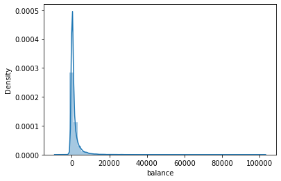 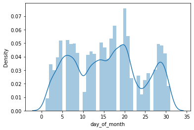  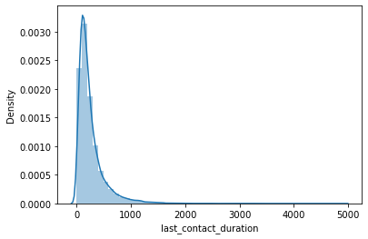  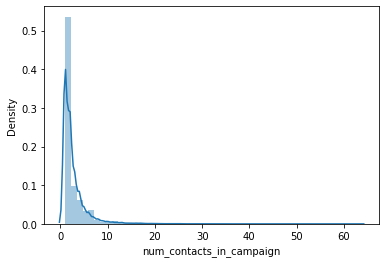  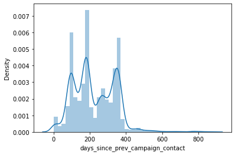 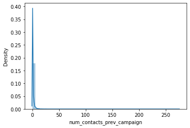 

#Categorical Data vs Target

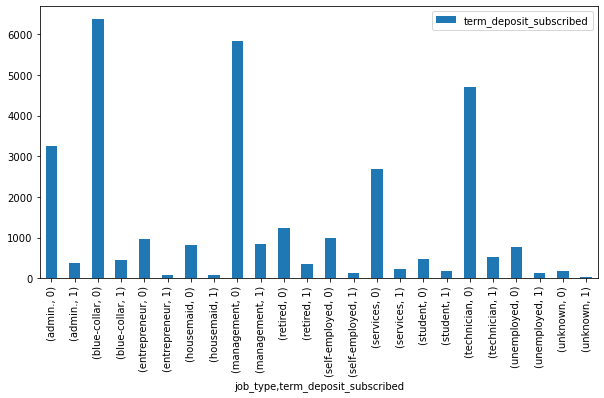 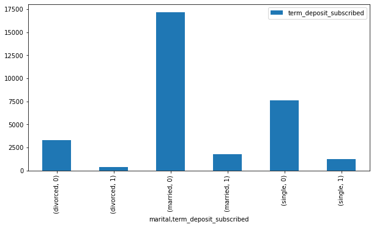 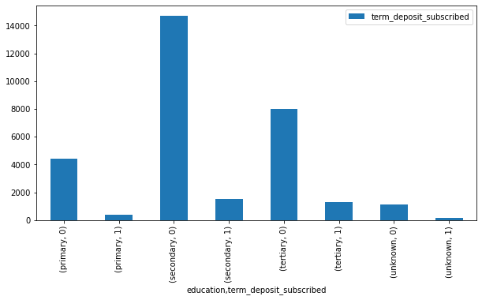
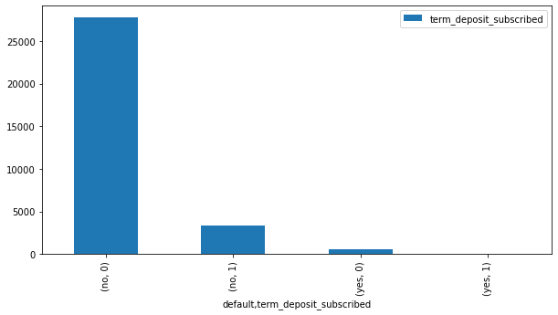 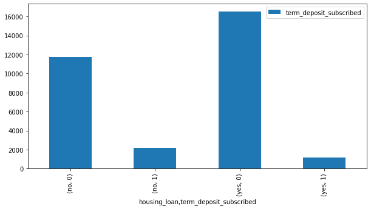 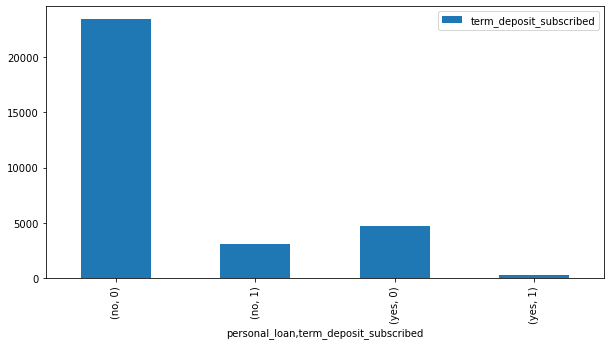
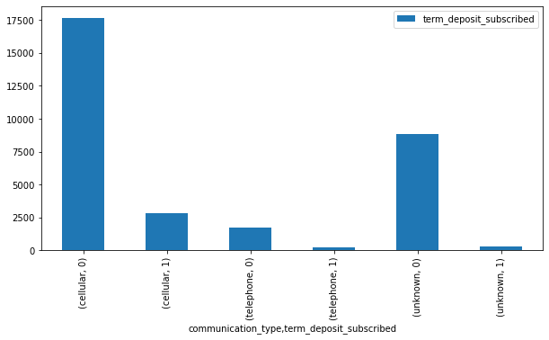 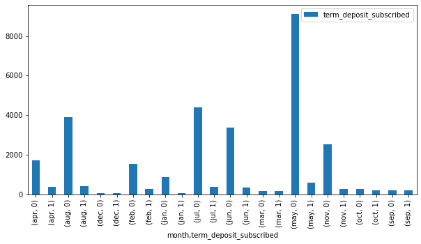 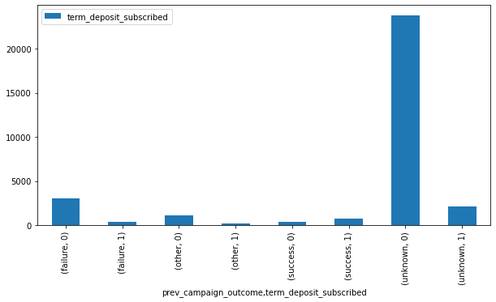

Check for NaN values

There are many NaN values needed to be imputed or removed
#last_contact_duration:311, num_contacts_in_campaign :112, days_since_prev_campaign_contact :25831

since the days_since_prev_campaign_contact NaN values is about 80% of the data, the column will be removed from features


# STEP 3) DATA CLEANING

Remove days_since_prev_campaign_contact column 
```
df= df.drop(labels='days_since_prev_campaign_contact',axis=1)
con_column.remove('days_since_prev_campaign_contact')
```

Label encoder all categorical data and convert alphabet to numerical values
#save label encoder pickle 

Fill in NaN values with Imputer

`#Use iterative imputer to fill in remaining NaN values
ii = IterativeImputer()
df_II = ii.fit_transform(df)
df= pd.DataFrame(df_II)
df.columns= column_names

#round of data to integer value
for index, i in enumerate(column_names):
    df[i]= np.floor(df[i]).astype('int')`

# STEP 4) FEATURES SELECTION

Use Logistic Regression to determine accuracy score between continuous data and categorical data

Results:

```
customer_age : 0.892754447498973
balance : 0.8925648560685057
day_of_month : 0.892754447498973
last_contact_duration : 0.8996429361392865
num_contacts_in_campaign : 0.892754447498973
num_contacts_prev_campaign : 0.8918064903466363
```

Use Cramer's V to determine accuracy score between categorical data and categorical data

Results:

```
job_type: accuracy is 0.13596388961197914
marital: accuracy is 0.06396495992281373
education: accuracy is 0.07207191785440015
default: accuracy is 0.018498692474409054
housing_loan: accuracy is 0.144442194297714
personal_loan: accuracy is 0.06550522151922447
communication_type: accuracy is 0.14713602417060107
month: accuracy is 0.2713965669912321
prev_campaign_outcome: accuracy is 0.3410607961880476
```

All continuous data has high correlation value(>0.8) with target term_deposit_subscribed
#Hence is selected as Features -> X

`X = df[con_column]
y = df['term_deposit_subscribed']`

# STEP 5) DATA PRE-PROCESSING

Use Standard Scaler to fit and scale all Features(X) 

Use OneHotEncoder for target since term_deposit_subscribed is categorical

`ohe= OneHotEncoder(sparse=False)
y=ohe.fit_transform(np.expand_dims(y,axis=-1))`

Train test split data into train and test set

`x_train,x_test,y_train,y_test=train_test_split(X,y,test_size=0.3, random_state=123)`


# STEP 6) MODEL DEVELOPMENT

Use two_layer_model using Input, Dense, Dropout Rate, BatchNormalization features

Visualising Neural Network model
plot_model(model,show_shapes=True, show_layer_names=(True))

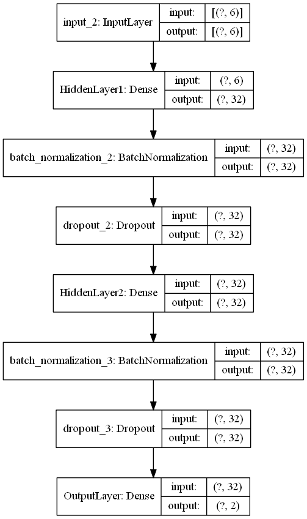

Compile model with categorical_crossentropy loss hyperparameters

`model.compile(optimizer='adam',loss='categorical_crossentropy',metrics=['acc'])`

Callbacks: tensorboard_callback and early_stopping_callback

# STEP 7) MODEL ANALYSIS

#Model Fitting and Testing with 100 epochs and batch size= 64

`hist = model.fit(x=x_train,y=y_train,batch_size=64,epochs=100, validation_data=(x_test,y_test), callbacks=[tensorboard_callback,early_stopping_callback])`

# STEP 8) MODEL EVALUATION
  
Plot history for training accuracy and validation(test) accuracy

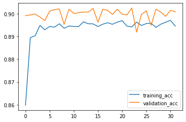

Plot training loss and validation(test) loss

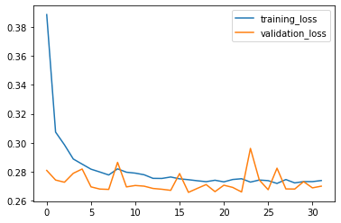

TensorBoard function for all logs data

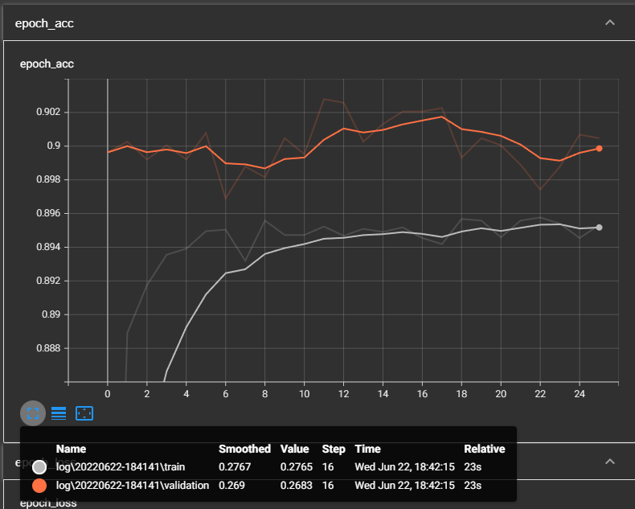

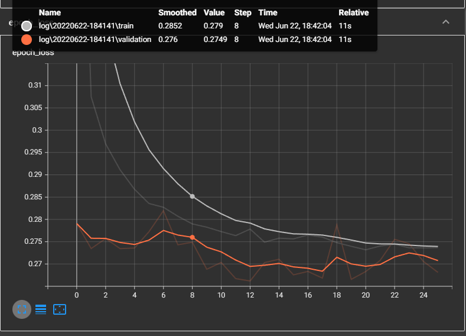

Model evaluation
me.model_evaluation(model, x_test, y_test)

  `  [0.2656640410423279, 0.9022643566131592]`

Classification Report
```
                  precision    recall  f1-score   support
               0       0.91      0.99      0.95      8504
               1       0.61      0.19      0.29       991
        accuracy                           0.90      9495
       macro avg       0.76      0.59      0.62      9495
    weighted avg       0.88      0.90      0.88      9495
 ```

Confussion Matrix

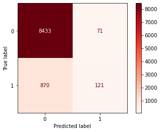


# STEP 9) MODEL SAVING
#saving ohe model, std scaler model and Neural network model

# Discussion

#The deep learning model achieved a good performance with 90% accuracy
showing 'customer_age', 'balance', 'day_of_month', 'last_contact_duration',
num_contacts_in_campaign', 'days_since_prev_campaign_contact',
'num_contacts_prev_campaign'has the highest correlation (above 80%) with 'term_deposit_subscribed'

Since term_deposit_subscribed data is unbalanced,
The model should be improved in the future by training more dataset into the model and reducing the underfitting model.

